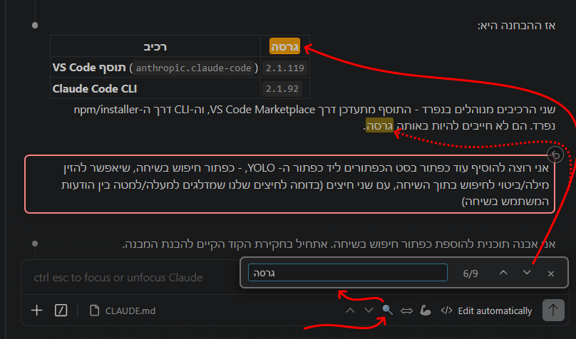
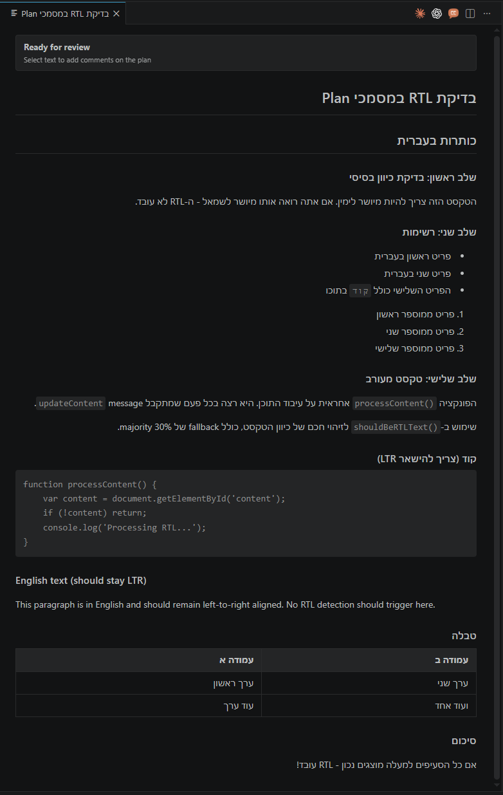
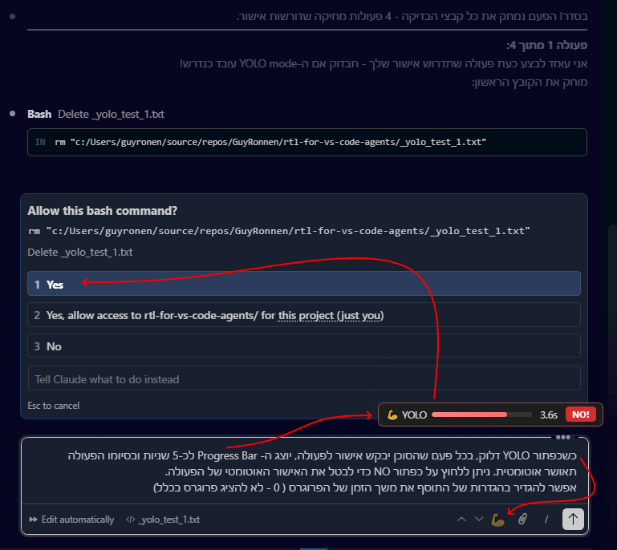
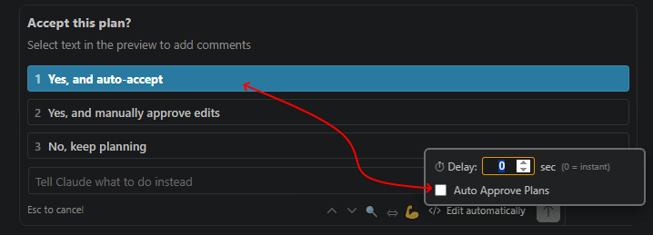
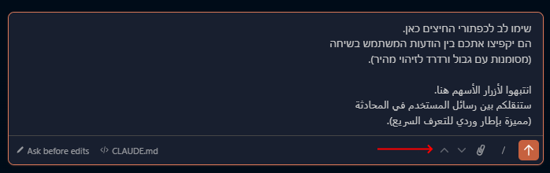
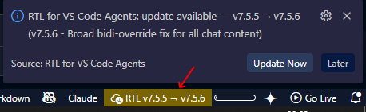
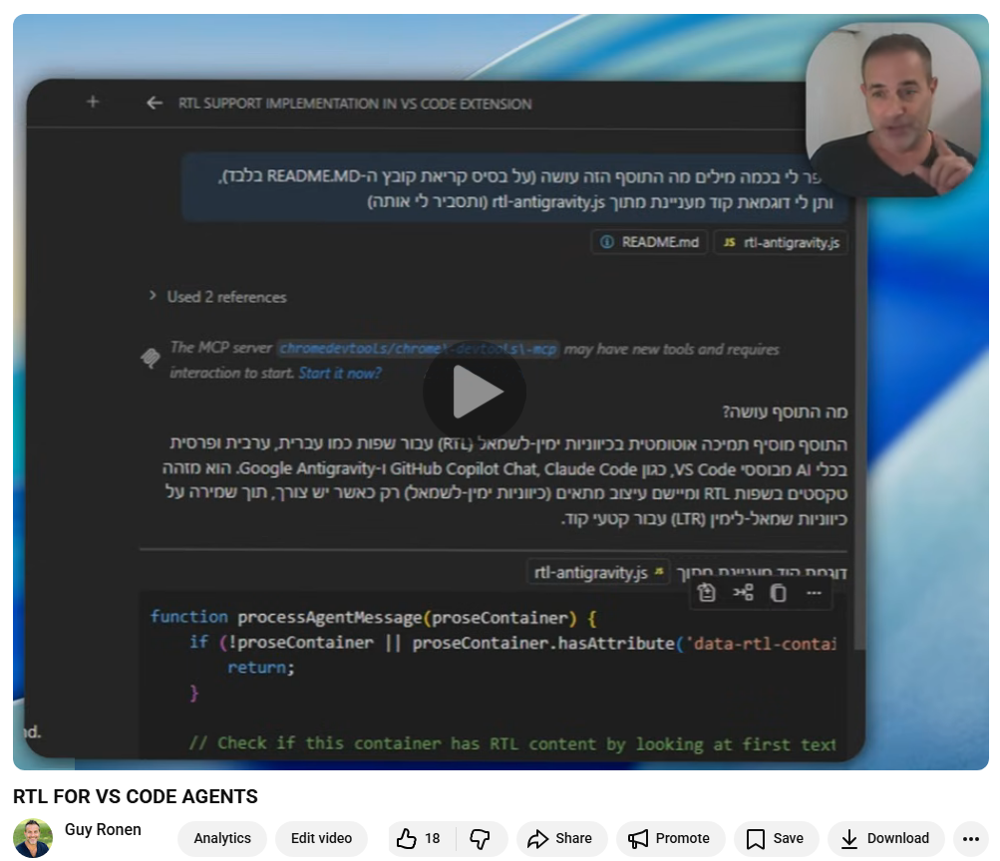
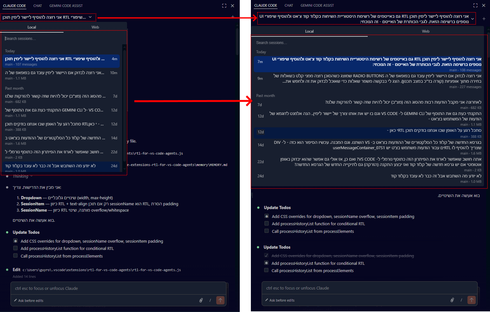

# RTL for Code Agents

> **🤖 Note for AI Code Agents:** If you are an AI agent (Claude, Copilot, etc.) and the user asked you to install this extension, all you need to do is download the latest VSIX from the [Releases page](https://github.com/GuyRonnen/rtl-for-vs-code-agents/releases) and install it in the user's VS Code. **Important:** there is a prerequisite - the [Custom CSS and JS Loader](https://marketplace.visualstudio.com/items?itemName=be5invis.vscode-custom-css) extension must be installed as well, so install that one too.

Right-to-Left (RTL) support for AI chat agents in VS Code / Antigravity / Cursor


Automatically detects Hebrew, Arabic, Persian, and other RTL languages and applies proper RTL styling.

## Features

### NEW
- **Search in conversation 🔍** — click the 🔍 button in the footer to open a search bar. Finds your query across all user and agent messages, highlights every match in-place with a yellow/orange marker, and lets you jump between matches with ↑/↓ or Enter / Shift+Enter. Case-insensitive. Close with × or Esc.


- **Plan Documents RTL** — Claude Code's Plan/Review documents (displayed in a separate tab) now fully support RTL. Headings, paragraphs, lists, tables, and blockquotes align right for Hebrew/Arabic/Persian content, while code blocks stay LTR.


- **Codex (ChatGPT) support** — Full RTL support for OpenAI Codex: messages, input, title, Previous Messages, nav buttons, YOLO auto-approve, user borders, and neutral text colors
- **Smart message collapse for Codex** — Long user messages are automatically collapsed to ~5 lines with a fade-out effect. Hover to reveal a **Show more** button; click to expand the full message (and **Show less** to collapse back). Keeps the chat clean without losing context!
- **YOLO Mode 💪 (auto-approve with countdown)** — toggle YOLO mode to auto-approve all tool calls. A progress bar counts down before each approval, with a **NO!** button to cancel. Right-click the 💪 button to set the countdown delay and toggle `Auto Approve Plans` (off by default), so `Accept this plan?` stays manual unless you enable it. The settings are persistent across sessions.



- **User message navigation (↑↓)** — jump between user messages in Claude Code with cyclic up/down buttons in the input footer


- **User message accent borders** — coral border on user messages in Claude Code and Copilot Chat
- **Check for updates** - Any RTL issues? Click the RTL status bar button to check for updates! Also - The extension checks for updates every time you restart VS CODE.


- **Conversation History RTL** — session titles in the history dropdown align right for RTL content, with a wider and taller dropdown

- **Agent Questions RTL support** — question text, options, and navigation tabs align right in Plan Mode and other agent prompts

### Core Features
- **Automatic RTL** — detects RTL textion for Hebrew, Arabic, Persian, Urdu, and more
- Code blocks remain LTR
- **Input box RTL support**
- Works with GitHub Copilot Chat, Claude Code, Codex (ChatGPT), Gemini Code Assist, and Antigravity Chat
- Automatic injection into Claude Code, Codex, and Gemini Code Assist (no manual setup needed)

## Preview

### Click to watch me demonstrate it:
[](https://youtu.be/9-sickqyI6Q)

### Full RTL Support in Major Code Agents:
Copilot, Claude Code & Gemini Code Assist!

RTL is automatically applied for all RTL texts in: user messages, agent responses, input box, and even agent questions in Plan Mode. All align right for RTL content:


### Agent Questions in Plan Mode

When Claude Code asks you questions (e.g. in Plan Mode), the popup now fully supports RTL — question text, option labels, descriptions, and navigation tabs all align right for Hebrew/RTL content. The free-text "Other" input also switches to RTL automatically.


### Conversation History List

Session titles in the chat history dropdown now align right for RTL content. The dropdown is wider and taller, and titles wrap instead of being truncated. The current session title in the header also wraps and grows with content.



### Check for updates

Any RTL issues? Click the RTL status bar button to check for updates!
Also - The extension checks for updates every time you restart VS CODE.


## Installation

### VSIX Installation (Recommended)

1. Download the latest `.vsix` file from [Releases](https://github.com/GuyRonnen/rtl-for-vs-code-agents/releases)
2. In VS Code: `Ctrl+Shift+X` → `...` → "Install from VSIX..."


3. Select the downloaded file
4. Restart VS Code

That's it! The extension automatically injects RTL support into Claude Code, Codex (ChatGPT), and Gemini Code Assist - no additional setup needed.

### To Enable RTL in GitHub Copilot Chat also:

Copilot Chat requires the [Custom CSS and JS Loader](https://marketplace.visualstudio.com/items?itemName=be5invis.vscode-custom-css) extension:

1. Install [this](https://marketplace.visualstudio.com/items?itemName=be5invis.vscode-custom-css) extension
2. Run command (Ctrl+Shift+P): **RTL for VS Code Agents: Configure Custom CSS Loader**
3. Run command (Ctrl+Shift+P): **Enable Custom CSS and JS** (from Custom CSS extension)
4. Restart VS Code


## And what about RTL for web chats!?
### (i.e. Claude.ai / NotebookLM / Perplexity / ChatGPT) and SaaSs (i.e. Slack / Monday / Heptabse)
### I've got you there also!!
[](https://multi-rtl.asia-digital.online)

is all you need!

### Check it out: [https://multi-rtl.asia-digital.online](https://multi-rtl.asia-digital.online)


## Now back to RTL for VS Code Agents:

<details>
<summary>Commands</summary>

- **RTL for VS Code Agents: Check and Inject** - Manually check and inject RTL into Claude Code, Codex, and Gemini Code Assist
- **RTL for VS Code Agents: Configure Custom CSS Loader** - Configure Custom CSS extension for Copilot Chat
- **RTL for VS Code Agents: Check for Updates** - Check GitHub for a newer version and install it
- **RTL for VS Code Agents: Remove All RTL Injections** - Restore all original files (run before uninstalling the extension)
</details>

<details>
<summary>Settings</summary>

| Setting | Default | Description |
|---------|---------|-------------|
| `rtlForVsCodeAgents.autoInject` | `true` | Automatically inject RTL into new Claude Code / Codex / Gemini versions |
| `rtlForVsCodeAgents.checkIntervalHours` | `0` | How often to check (0 = startup only) |
| `rtlForVsCodeAgents.autoConfigureCustomCss` | `false` | Automatically configure Custom CSS Loader |
| `rtlForVsCodeAgents.autoCheckUpdates` | `true` | Automatically check for extension updates from GitHub on startup |
| `rtlForVsCodeAgents.updateCheckIntervalHours` | `24` | How often to check for updates (0 = startup only) |
| `rtlForVsCodeAgents.userMessageBorder` | `true` | Show coral border on user messages. Easier to toggle via right-click on ↑↓ buttons |
| `rtlForVsCodeAgents.yoloCountdownSeconds` | `5` | YOLO mode countdown before auto-approve (0 = instant). Easier to change via right-click on the 💪 button |
</details>

<details>
<summary>Troubleshooting</summary>

| Problem | Solution |
|---------|----------|
| "[Unsupported]" in title bar | Normal - this is expected when using Custom CSS |
| RTL not working in Claude Code / Codex / Gemini | Run "Check and Inject" command |
| RTL not working in Copilot | Run "Configure Custom CSS Loader", then "Enable Custom CSS and JS" |
| RTL stopped after VS Code update | The extension will notify you automatically — click "Enable Custom CSS" and run "Reload Window" |
</details>

<details>
<summary>Manual Installation (Advanced)</summary>

For manual installation or troubleshooting, scripts are available:

### Windows
```powershell
powershell -ExecutionPolicy Bypass -File .\install.ps1
```

### Mac/Linux
```bash
./install.sh
```

### Diagnostics
```powershell
# Windows
powershell -ExecutionPolicy Bypass -File .\diagnose-rtl.ps1

# Mac/Linux
./diagnose-rtl.sh
```
</details>
<details>
<summary>Changelog</summary>

### v10.1.1
- **WSL/Remote detection:** Added support for detecting Claude Code, Codex, and Gemini installations under VS Code/Cursor remote server extension folders such as `~/.vscode-server/extensions`

### v10.1.0
- **YOLO plan approval control:** Added `Auto Approve Plans` to the YOLO right-click popup, off by default, so `Accept this plan?` stays manual unless explicitly enabled

### v10.0.1
- **Restart Extension Host instead of Reload Window:** Post-injection notices now offer "Restart Extension Host" as the primary action — a lighter, faster operation than a full window reload. Applies to injection, removal, and settings-change flows. "Reload Window" remains available as a secondary option, and the Copilot path still requires it.

### v10.0.0
- **Search in conversation 🔍:** new search bar with in-place `<mark>` highlighting for every match across user + agent messages. Navigate with ↑/↓ or Enter / Shift+Enter. Case-insensitive, closes on × or Esc. Counter shows position (e.g. 3/12).
- **Outline for floating popups:** lighter gray 2px outline on the search bar and YOLO settings popup for better visibility.

### v9.1.0
- **Plan Documents RTL:** Claude Code's Plan/Review documents (separate tab) now fully support RTL — headings, paragraphs, lists, tables, and blockquotes align right for RTL content, while code blocks stay LTR. Injected via a lightweight inline script with proper CSP nonce support.

### v9.0.0
- **Codex (ChatGPT) support:** Full RTL support for OpenAI Codex chat — messages, input box, conversation title, Previous Messages section, navigation buttons, YOLO auto-approve, and user message borders
- **Smart message collapse for Codex:** Long user messages auto-collapse to ~5 lines with fade-out. Hover for "Show more" button, click to expand/collapse
- **Neutral text color in Codex:** Override Codex's blue-tinted text with clean neutral colors (light for dark theme, dark for light theme)

### v8.2.5
- **Fix RTL detection with attachments:** Skip attachment containers (filenames, dimensions) when detecting text direction, so Hebrew messages with attachments align correctly
- **Expand collapsed user messages:** Increase collapsed message preview from ~3 lines to ~5 lines

### v8.2.4
- **Fix session history list:** Items now have proper spacing and separator lines (override fixed height)
- **Fix header accent border:** Update selector for new Claude Code DOM structure
- **Move nav/YOLO buttons:** Repositioned next to "Ask before edits" button

### v8.2.2
- **Fix mention mirror RTL sync:** Fixed cursor misalignment in Claude Code 2.1.76+ input box — the new mentionMirror overlay now syncs RTL direction with the input, keeping the caret aligned with visible text

### v8.2.1
- **Bright scrollbar:** Chat panel scrollbar is now much more visible (brighter thumb, wider track) for easier navigation in long conversations

### v8.2.0
- **User message border toggle:** New `userMessageBorder` setting and instant right-click toggle on ↑↓ navigation buttons — toggle the coral border on user messages on/off without reload (persisted via localStorage)

### v8.1.0
- **YOLO Mode 💪 (auto-approve with countdown):** Toggle YOLO mode with the 💪 button to auto-approve all tool calls. A countdown progress bar with a **NO!** cancel button appears before each approval. Right-click the button to adjust the delay (0 = instant) and control whether plan approvals are auto-accepted. Settings are persistent via localStorage.
- **YOLO countdown settings:** Configurable via VS Code Settings (`yoloCountdownSeconds`) or right-click on the 💪 button for instant changes, including the new `Auto Approve Plans` toggle

### v8.0.1
- **Fix BiDi ordering in mixed Hebrew/English lines:** Lines starting with bold text followed by English in parentheses (e.g. `**term** (English explanation)`) now correctly align RTL. Fixed by injecting RLM anchors and switching from `unicode-bidi: plaintext` to `isolate`.

### v8.0.0
- **User message navigation (↑↓):** Jump between user messages in Claude Code chat with cyclic up/down buttons in the input footer
- **Copilot user message borders:** User messages in GitHub Copilot Chat now have a coral accent border matching Claude Code
- **Improve reload notifications:** Add 'Reload Window' button to all injections and removals — soft reload instead of manual Ctrl+Shift+P
- **Install/Uninstall scripts:** No longer force-restart VS Code — reload happens via extension notification button

### v7.5.6
- **Broad bidi-override fix:** Cancel Claude Code's `unicode-bidi: bidi-override` across all chat content (tables, lists, headings, etc.) — not just RTL-marked elements

### v7.5.5
- **Permission reject input RTL:** The free-text input in permission dialogs (e.g. "Make this edit?") now switches to RTL when typing Hebrew

### v7.5.4
- **Fix bidi-override on history title:** Session title and history list items now get `data-rtl-applied` marker so the bidi-override CSS fix covers them too

### v7.5.3
- **Fix Claude Code bidi-override:** Counter the global `* { unicode-bidi: bidi-override }` rule added in Claude Code v2.1.63 that broke all RTL text rendering

### v7.5.2
- **Fix Custom CSS stale imports:** Auto-update no longer accumulates old entries in `vscode_custom_css.imports` — old RTL paths are cleaned up automatically on each configure

### v7.5.1
- **Status Bar Quick Menu:** Click the `RTL v7.5.1` button in the status bar to open a quick menu with all extension actions — also triggers an update check in the background

### v7.5.0
- **Auto-Update:** Check for new versions from GitHub and install with one click — no more manual VSIX downloads
- **Status Bar Button:** Shows current version in the bottom bar; highlights when an update is available
- **Update Settings:** `autoCheckUpdates` and `updateCheckIntervalHours` control automatic checking
- **Post-Update Re-injection:** After updating, old RTL injections are automatically restored and re-injected with the new script
- **Remove Injections Command:** New "Remove All RTL Injections" command to cleanly restore all files before uninstalling

### v7.3.1
- **Session Title Line Clamp:** Session title limited to 3 lines, preventing long prompts from overflowing
- **UI Accent Borders:** Light purple border on history header, coral border on user messages

### v7.3.0
- **Conversation History RTL:** Session titles in the history dropdown align right for Hebrew/RTL content
- **History Dropdown UI:** Wider and taller dropdown, session names wrap instead of being truncated
- **Session Header Button:** Current session title wraps and grows with content instead of being clipped

### v7.2.0
- **Agent Questions RTL:** Question text, option labels, descriptions, and nav tabs in Claude Code's agent prompts (Plan Mode) now align right for Hebrew/RTL content
- **Agent Questions Input:** The "Other" free-text input in agent popups switches to RTL when typing Hebrew

### v7.1.0
- **Copilot RTL Detection:** Auto-detects if Copilot injection was lost after a VS Code update and notifies
- **English-only Notifications:** Fixes BiDi rendering issues in VS Code's notification UI

### v7.0.0
- **Gemini Code Assist:** RTL support for Google Gemini Code Assist chat
- **Auto Injection:** Detects and injects into Gemini Code Assist automatically
- **Smart RTL Detection:** Direction based on first strong character (skips emojis, numbers, bullets)
- **Majority Fallback:** Mixed Hebrew/English text (≥30% RTL letters) correctly detected as RTL
- **List Bullets Fix:** RTL list items no longer lose their bullets

### v6.0.0
- **Cursor Support:** Claude Code in Cursor now supported
- **Auto Injection:** Detects Claude Code in VS Code, Cursor, and Antigravity

### v5.0.0
- **VS Code Extension:** Now available as a proper VS Code extension (.vsix)
- **Selectors:** Update Claude Code selectors for new version

### v4.3.3
- **Diagnostics:** Fix selector extraction

### v4.2.1
- **Antigravity Chat:** Fix streaming RTL
- **Selectors:** Update Claude Code and Antigravity selectors

</details>

<details>
<summary>Older versions</summary>

### v4.2.0
- Smarter installer - detects all Claude Code versions

### v4.0.0
- Add Claude Code injection for Antigravity
- Fix streaming messages RTL detection

### v3.0.0
- Fix input box RTL flickering

### v2.0.0
- Add automated installation scripts
- Add RTL support for input boxes

### v1.0.0
- Initial release with GitHub Copilot Chat support

</details>

## Credits

The **YOLO Mode** feature (auto-approve with countdown) is based on the original idea and JavaScript snippet by [Chris Le](https://github.com/chrisle) — see the [original gist](https://gist.github.com/chrisle/c6f187278e27f0168d982cd84de08b92).

## License

GPL-3.0
