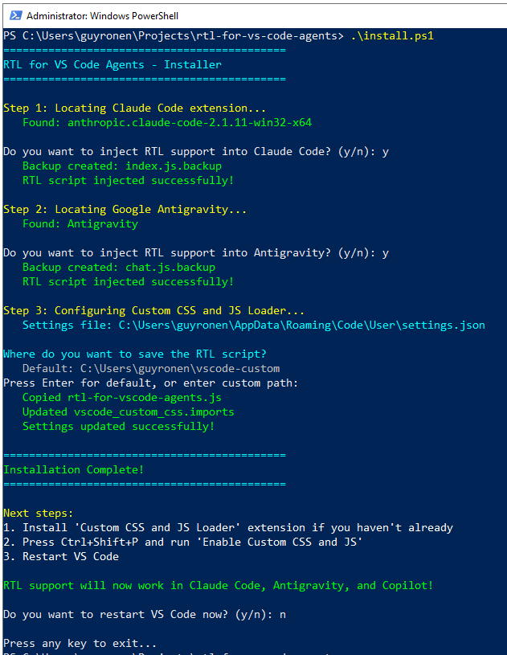

# RTL for VS Code Agents

Right-to-Left (RTL) support for AI chat agents in Visual Studio Code.

Automatically detects Hebrew, Arabic, Persian, and other RTL languages and applies proper RTL styling.

## Features

- Automatic RTL detection for Hebrew, Arabic, Persian, Urdu, and more
- Code blocks remain LTR
- Works with GitHub Copilot Chat, Claude Code (VS Code + Antigravity), and Google Antigravity
- Input box RTL support

## Preview

[](https://youtu.be/9-sickqyI6Q)

## Installation

### Windows

```powershell
powershell -ExecutionPolicy Bypass -File .\install.ps1
```

### Mac/Linux

```bash
./install.sh
```

The installer handles everything automatically:
- Installs the Custom CSS and JS Loader extension
- Configures VS Code settings
- Injects RTL support into Claude Code (both VS Code and Antigravity)
- Injects RTL support into Antigravity's built-in chat



## Uninstalling

```powershell
.\uninstall.ps1
```

Restores all original files from backups.

## After Updates

If RTL stops working after updating VS Code or Claude Code:

1. Re-run `install.ps1` to re-inject the scripts
2. If that doesn't help, the CSS selectors may have changed - please open an issue

## Troubleshooting

| Problem | Solution |
|---------|----------|
| "[Unsupported]" in title bar | Normal - this is expected |
| RTL not applied | Run `Reload Custom CSS and JS` command, then restart VS Code |
| RTL stopped after update | Re-run `install.ps1` |

## Changelog

### v4.2.0
- **Smarter Installer:** `install.ps1` and `install.sh` now detect and patch **all** installed versions of Claude Code (VS Code & Antigravity), ensuring RTL works even after extension updates or side-by-side installations.
- **Enhanced Uninstaller:** `uninstall.ps1` cleans up all detected versions.
- **Performance:** Optimized selectors (reverted unnecessary Shadow DOM traversals).

### v4.0.1
- **Unified Script:** Merged Google Antigravity support directly into the main `rtl-for-vs-code-agents.js`. No separate injection files needed.
- **Cleanup:** Removed deprecated separate script files.

### v4.0.0
- Add Claude Code injection for Antigravity
- Fix streaming messages RTL detection
- Update selectors for Claude Code 2.1.19
- Remove redundant script files
- Simplify codebase and README

### v3.0.5
- Add installation script screenshot to README

### v3.0.4
- Improve installer and documentation

### v3.0.3
- Fix user message selector for Claude Code

<details>
<summary>Older versions</summary>

### v3.0.2
- Update selectors for Claude Code 2.1.5

### v3.0.0
- Fix input box RTL flickering in Copilot chat

### v2.0.0
- Add automated installation scripts
- Add RTL support for input boxes

### v1.0.0
- Initial release with GitHub Copilot Chat support

</details>

## License

GPL-3.0
