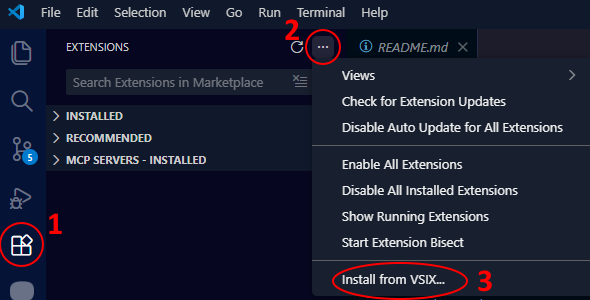

# RTL for VS Code Agents

Right-to-Left (RTL) support for AI chat agents in Visual Studio Code.

Automatically detects Hebrew, Arabic, Persian, and other RTL languages and applies proper RTL styling.

## Features

- Automatic RTL detection for Hebrew, Arabic, Persian, Urdu, and more
- Code blocks remain LTR
- Works with GitHub Copilot Chat, Claude Code, and Antigravity
- Input box RTL support
- Automatic injection into Claude Code (no manual setup needed)

## Preview

[](https://youtu.be/9-sickqyI6Q)

## Installation

### VSIX Installation (Recommended)

1. Download the latest `.vsix` file from [Releases](https://github.com/GuyRonnen/rtl-for-vs-code-agents/releases)
2. In VS Code: `Ctrl+Shift+X` → `...` → "Install from VSIX..."


3. Select the downloaded file
4. Restart VS Code

That's it! The extension automatically injects RTL support into Claude Code - no additional setup needed.

### To Enable RTL in GitHub Copilot Chat also:

Copilot Chat requires the [Custom CSS and JS Loader](https://marketplace.visualstudio.com/items?itemName=be5invis.vscode-custom-css) extension:

1. Install [this](https://marketplace.visualstudio.com/items?itemName=be5invis.vscode-custom-css) extension
2. Run command (Ctrl+Shift+P): **RTL for VS Code Agents: Configure Custom CSS Loader**
3. Run command (Ctrl+Shift+P): **Enable Custom CSS and JS** (from Custom CSS extension)
4. Restart VS Code

<details>
<summary>Commands</summary>

- **RTL for VS Code Agents: Check and Inject Claude Code** - Manually check and inject RTL into Claude Code
- **RTL for VS Code Agents: Configure Custom CSS Loader** - Configure Custom CSS extension for Copilot
</details>

<details>
<summary>Settings</summary>

| Setting | Default | Description |
|---------|---------|-------------|
| `rtlForVsCodeAgents.autoInject` | `true` | Automatically inject RTL into new Claude Code versions |
| `rtlForVsCodeAgents.checkIntervalHours` | `0` | How often to check (0 = startup only) |
| `rtlForVsCodeAgents.autoConfigureCustomCss` | `false` | Automatically configure Custom CSS Loader |
</details>

<details>
<summary>Troubleshooting</summary>

| Problem | Solution |
|---------|----------|
| "[Unsupported]" in title bar | Normal - this is expected when using Custom CSS |
| RTL not working in Claude Code | Run "Check and Inject Claude Code" command |
| RTL not working in Copilot | Run "Configure Custom CSS Loader", then "Enable Custom CSS and JS" |
| RTL stopped after VS Code update | Restart VS Code or run inject command again |
</details>

<details>
<summary>Manual Installation (Advanced)</summary>

For manual installation or troubleshooting, scripts are available:

### Windows
```powershell
powershell -ExecutionPolicy Bypass -File .\install.ps1
```

### Mac/Linux
```bash
./install.sh
```

### Diagnostics
```powershell
# Windows
powershell -ExecutionPolicy Bypass -File .\diagnose-rtl.ps1

# Mac/Linux
./diagnose-rtl.sh
```
</details>
<details>
<summary>Changelog</summary>


See [CHANGELOG.md](CHANGELOG.md) for full history.

### v5.0.0
- **VS Code Extension:** Now available as a proper VS Code extension (.vsix)
- **Easy Installation:** Just install the extension - no manual scripts needed
- **Selectors:** Update Claude Code selectors for new version

### v4.3.3
- **Diagnostics:** Fix selector extraction

### v4.2.1
- **Antigravity Chat:** Fix streaming RTL
- **Selectors:** Update Claude Code and Antigravity selectors

</details>

<details>
<summary>Older versions</summary>

### v4.2.0
- Smarter installer - detects all Claude Code versions

### v4.0.0
- Add Claude Code injection for Antigravity
- Fix streaming messages RTL detection

### v3.0.0
- Fix input box RTL flickering

### v2.0.0
- Add automated installation scripts
- Add RTL support for input boxes

### v1.0.0
- Initial release with GitHub Copilot Chat support

</details>

## License

GPL-3.0
