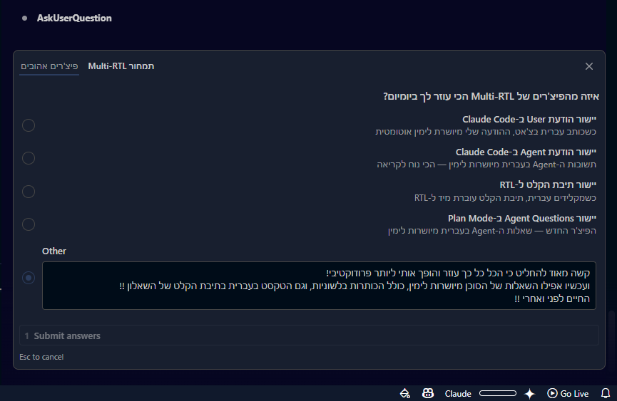
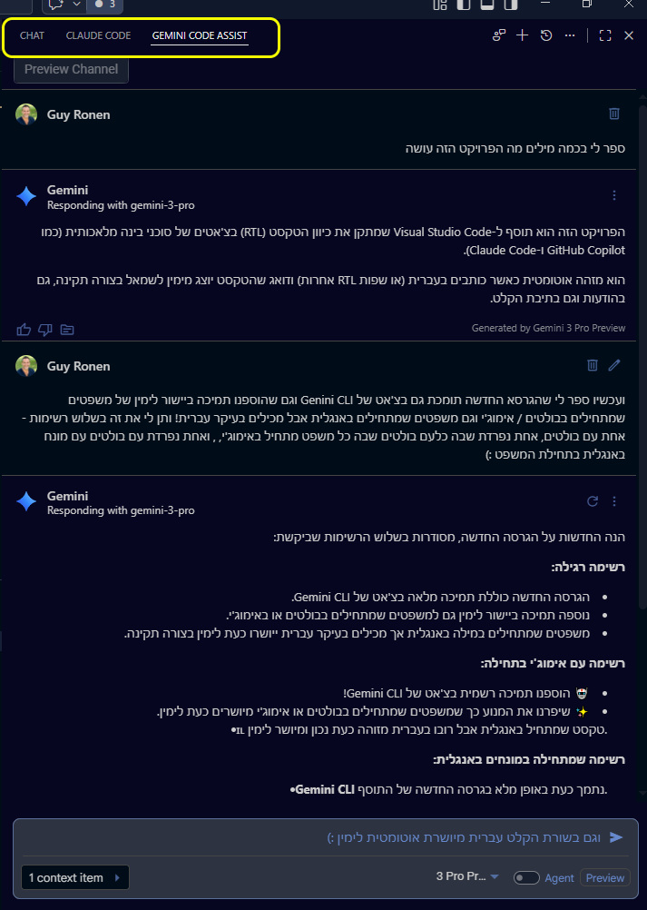
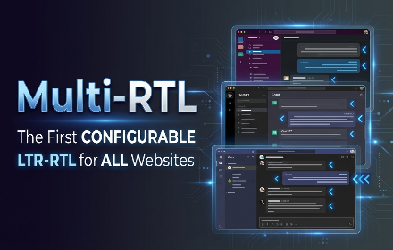

# RTL for VS Code Agents

Right-to-Left (RTL) support for AI chat agents in Visual Studio Code.

Automatically detects Hebrew, Arabic, Persian, and other RTL languages and applies proper RTL styling.

## Features

- Automatic RTL detection for Hebrew, Arabic, Persian, Urdu, and more
- Code blocks remain LTR
- Works with GitHub Copilot Chat, Claude Code (VS Code, Cursor, Antigravity), Gemini Code Assist, and Antigravity Chat
- Input box RTL support
- Agent Questions RTL support — question text, options, and navigation tabs align right in Plan Mode and other agent prompts
- Automatic injection into Claude Code and Gemini Code Assist (no manual setup needed)

## Preview

[](https://youtu.be/9-sickqyI6Q)

## Installation

### VSIX Installation (Recommended)

1. Download the latest `.vsix` file from [Releases](https://github.com/GuyRonnen/rtl-for-vs-code-agents/releases)
2. In VS Code: `Ctrl+Shift+X` → `...` → "Install from VSIX..."


3. Select the downloaded file
4. Restart VS Code

That's it! The extension automatically injects RTL support into Claude Code and Gemini Code Assist - no additional setup needed.

### Agent Questions in Plan Mode

When Claude Code asks you questions (e.g. in Plan Mode), the popup now fully supports RTL — question text, option labels, descriptions, and navigation tabs all align right for Hebrew/RTL content. The free-text "Other" input also switches to RTL automatically.



### Gemini Code Assist — Full RTL Support

RTL is automatically injected into Gemini Code Assist — user messages, agent responses, and the input box all align right for Hebrew/RTL content.



### To Enable RTL in GitHub Copilot Chat also:

Copilot Chat requires the [Custom CSS and JS Loader](https://marketplace.visualstudio.com/items?itemName=be5invis.vscode-custom-css) extension:

1. Install [this](https://marketplace.visualstudio.com/items?itemName=be5invis.vscode-custom-css) extension
2. Run command (Ctrl+Shift+P): **RTL for VS Code Agents: Configure Custom CSS Loader**
3. Run command (Ctrl+Shift+P): **Enable Custom CSS and JS** (from Custom CSS extension)
4. Restart VS Code


## And what about RTL for web chats!?
### (i.e. Claude.ai / NotebookLM / Perplexity / ChatGPT) and SaaSs (i.e. Slack / Monday / Heptabse)
### I've got you there also!!
[](https://multi-rtl.interact-ed.online)

is all you need!


## Now back to RTL for VS Code Agents:

<details>
<summary>Commands</summary>

- **RTL for VS Code Agents: Check and Inject Claude Code** - Manually check and inject RTL into Claude Code
- **RTL for VS Code Agents: Configure Custom CSS Loader** - Configure Custom CSS extension for Copilot
</details>

<details>
<summary>Settings</summary>

| Setting | Default | Description |
|---------|---------|-------------|
| `rtlForVsCodeAgents.autoInject` | `true` | Automatically inject RTL into new Claude Code versions |
| `rtlForVsCodeAgents.checkIntervalHours` | `0` | How often to check (0 = startup only) |
| `rtlForVsCodeAgents.autoConfigureCustomCss` | `false` | Automatically configure Custom CSS Loader |
</details>

<details>
<summary>Troubleshooting</summary>

| Problem | Solution |
|---------|----------|
| "[Unsupported]" in title bar | Normal - this is expected when using Custom CSS |
| RTL not working in Claude Code / Gemini | Run "Check and Inject Claude Code" command |
| RTL not working in Copilot | Run "Configure Custom CSS Loader", then "Enable Custom CSS and JS" |
| RTL stopped after VS Code update | The extension will notify you automatically — click "Enable Custom CSS" and run "Reload Window" |
</details>

<details>
<summary>Manual Installation (Advanced)</summary>

For manual installation or troubleshooting, scripts are available:

### Windows
```powershell
powershell -ExecutionPolicy Bypass -File .\install.ps1
```

### Mac/Linux
```bash
./install.sh
```

### Diagnostics
```powershell
# Windows
powershell -ExecutionPolicy Bypass -File .\diagnose-rtl.ps1

# Mac/Linux
./diagnose-rtl.sh
```
</details>
<details>
<summary>Changelog</summary>


See [CHANGELOG.md](CHANGELOG.md) for full history.

### v7.2.0
- **Agent Questions RTL:** Question text, option labels, descriptions, and nav tabs in Claude Code's agent prompts (Plan Mode) now align right for Hebrew/RTL content
- **Agent Questions Input:** The "Other" free-text input in agent popups switches to RTL when typing Hebrew

### v7.1.0
- **Copilot RTL Detection:** Auto-detects if Copilot injection was lost after a VS Code update and notifies
- **English-only Notifications:** Fixes BiDi rendering issues in VS Code's notification UI

### v7.0.0
- **Gemini Code Assist:** RTL support for Google Gemini Code Assist chat
- **Auto Injection:** Detects and injects into Gemini Code Assist automatically
- **Smart RTL Detection:** Direction based on first strong character (skips emojis, numbers, bullets)
- **Majority Fallback:** Mixed Hebrew/English text (≥30% RTL letters) correctly detected as RTL
- **List Bullets Fix:** RTL list items no longer lose their bullets

### v6.0.0
- **Cursor Support:** Claude Code in Cursor now supported
- **Auto Injection:** Detects Claude Code in VS Code, Cursor, and Antigravity

### v5.0.0
- **VS Code Extension:** Now available as a proper VS Code extension (.vsix)
- **Selectors:** Update Claude Code selectors for new version

### v4.3.3
- **Diagnostics:** Fix selector extraction

### v4.2.1
- **Antigravity Chat:** Fix streaming RTL
- **Selectors:** Update Claude Code and Antigravity selectors

</details>

<details>
<summary>Older versions</summary>

### v4.2.0
- Smarter installer - detects all Claude Code versions

### v4.0.0
- Add Claude Code injection for Antigravity
- Fix streaming messages RTL detection

### v3.0.0
- Fix input box RTL flickering

### v2.0.0
- Add automated installation scripts
- Add RTL support for input boxes

### v1.0.0
- Initial release with GitHub Copilot Chat support

</details>

## License

GPL-3.0
